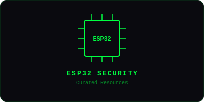

<div align="center">



# Awesome ESP32 Security

> Curated ESP32 security tools, firmware, and resources for pentesters and IoT researchers.

[](LICENSE)
[](https://github.com/ykrishhh/awesome-esp32-security)

</div>

---

## Features

| Category | Tools |
|----------|-------|
| Firmware Analysis | esptool.py, Binwalk, FACT |
| WiFi/BLE Attacks | WiFi Deauther, Bluetooth Explorer |
| Hardware Hacking | JTAG/UART, Bus Pirate, Logic Analyzers |
| Tools & Frameworks | ESP-IDF, PlatformIO, Micropython |

## Quick Start

```bash
git clone https://github.com/ykrishhh/awesome-esp32-security.git
cd awesome-esp32-security
```

## Contributing

Contributions welcome!

## License

[MIT License](LICENSE) — Built by [ykrishhh](https://github.com/ykrishhh)

---

<div align="center">

**Star this repo if you find it useful!** ⭐

</div>
