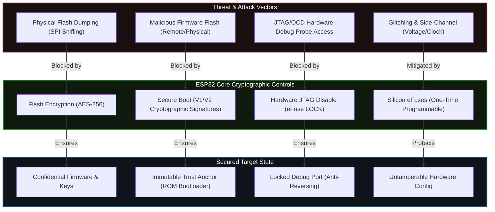

<div align="center">


# Awesome ESP32 Security

> Curated ESP32 security tools, firmware, and resources for pentesters and IoT researchers.

[](LICENSE)
[](https://github.com/ykrishhh/awesome-esp32-security)

</div>

---

## Features

| Category | Tools |
|----------|-------|
| Firmware Analysis | esptool.py, Binwalk, FACT |
| WiFi/BLE Attacks | WiFi Deauther, Bluetooth Explorer |
| Hardware Hacking | JTAG/UART, Bus Pirate, Logic Analyzers |
| Tools & Frameworks | ESP-IDF, PlatformIO, Micropython |

## Quick Start

```bash
git clone https://github.com/ykrishhh/awesome-esp32-security.git
cd awesome-esp32-security
```

## ESP32 Hardware Security Architecture

To secure an ESP32 deployment against both remote and physical attack vectors, the hardware architecture relies on a series of cryptographic and isolation mechanisms built into the silicon. Below is a structured threat-model mapping of ESP32's built-in security controls:



## BLE Security Tools

| Tool | Description | Platform |
|------|-------------|----------|
| [nRF Connect](https://play.google.com/store/apps/details?id=no.nordicsemi.android.mcp) | BLE scanner and debugger | Android/iOS |
| [BLE Scanner](https://play.google.com/store/apps/details?id=com.macdom.ble.blescanner) | Scan and explore BLE devices | Android |
| [GATTacker](https://github.com/AresS31/GATTacker) | BLE man-in-the-middle framework | Linux |
| [Bettercap](https://www.bettercap.org/) | BLE sniffing and attacks | Cross-platform |
| [Sweyntooth](https://asset-group.github.io/disclosures/sweyntooth/) | BLE vulnerabilities exploitation | Research |
| [Braktooth](https://github.com/Matheus-Garbelini/braktooth_esp32_bluetooth_classic_attacks) | ESP32 BT Classic attacks | ESP32 |

## Troubleshooting

Hit a wall with SPI/I2C, NRF24L01, power, flashing, or serial? See the
[ESP32 Security Troubleshooting Guide](docs/troubleshooting.md) — real fixes for
the failures that eat your first day.

## Contributing

Contributions welcome!

## License

[MIT License](LICENSE) — Built by [ykrishhh](https://github.com/ykrishhh)

---

<div align="center">

**Star this repo if you find it useful!** ⭐

</div>
